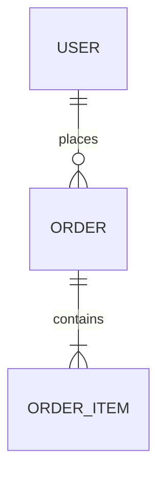
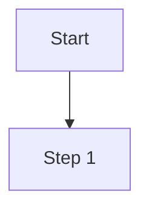

# Document Templates Reference

## 00_project_overview.md

```markdown
# Project Name

> One-liner: <Name> is a <type> that helps <audience> achieve <goal>.

## Tech Stack

| Layer | Technology |
|-------|-----------|
| Frontend | |
| Backend | |
| Database | |
| Deployment | |

## Document Index

| Document | Description |
|----------|------------|
| [PRD](01_PRD_product_requirements.md) | Product requirements |
| [TDD](02_TDD_architecture_design.md) | Architecture design |
| ... | |

## Quick Start

(Environment setup, startup commands, etc.)
```

---

## 01_PRD_product_requirements.md

```markdown
# Product Requirements Document (PRD)

**Version**: v1.0
**Last Updated**: YYYY-MM-DD
**Status**: Draft / In Review / Approved

---

## 1. Background & Goals

### 1.1 Project Background

### 1.2 Target Users

### 1.3 Core Goals

## 2. Functional Requirements

### 2.1 Feature List

| Feature | Description | Priority |
|---------|------------|----------|
| | | P0/P1/P2 |

### 2.2 User Stories

**As** [user role], **I want** [feature], **so that** [value].

**Acceptance Criteria**:
- [ ] Criterion 1
- [ ] Criterion 2

## 3. Non-Functional Requirements

- Performance:
- Security:
- Compatibility:

## 4. Out of Scope

Explicitly list what will NOT be included to avoid scope creep.

## 5. Changelog

| Version | Date | Changes | Author |
|---------|------|---------|--------|
| v1.0 | | Initial version | |
```

---

## 02_TDD_architecture_design.md

```markdown
# Architecture Design Document (TDD)

**Version**: v1.0
**Last Updated**: YYYY-MM-DD

---

## 1. System Overview

## 2. Technology Choices

| Category | Choice | Rationale |
|----------|--------|-----------|
| Backend Framework | | |
| Database | | |
| Cache | | |
| Message Queue | | |
| Deployment | | |

## 3. System Architecture

### 3.1 Architecture Diagram

(Use Mermaid or text description)

### 3.2 Module Breakdown

| Module | Responsibility |
|--------|---------------|
| | |

## 4. Key Flows

(Sequence diagrams or flowcharts for critical business flows)

## 5. Deployment Architecture

## 6. Technical Risks & Mitigations

| Risk | Impact | Mitigation |
|------|--------|-----------|
| | | |

## 7. Changelog

| Version | Date | Changes |
|---------|------|---------|
```

---

## 03_ERD_database_design.md

```markdown
# Database Design Document (ERD)

**Version**: v1.0
**Last Updated**: YYYY-MM-DD

---

## 1. Database Overview

- Database type:
- Database version:
- Character set:

## 2. Entity Relationship Diagram



## 3. Table Definitions

### Table: xxx

**Description**:

| Column | Type | Required | Default | Description |
|--------|------|----------|---------|-------------|
| id | BIGINT | Yes | Auto | Primary key |
| created_at | DATETIME | Yes | NOW() | Creation time |

**Indexes**:
- Primary key: `id`
- Unique index: `xxx`
- Index: `xxx` (for xxx queries)

## 4. Changelog

| Version | Date | Changes |
|---------|------|---------|
```

---

## 04_API_reference.md

```markdown
# API Reference

**Version**: v1.0
**Last Updated**: YYYY-MM-DD
**Base URL**: `https://api.example.com/v1`

---

## 1. General

### 1.1 Authentication

### 1.2 Common Response Format

```json
{
  "code": 0,
  "message": "success",
  "data": {}
}
```

### 1.3 Error Codes

| Code | Description |
|------|------------|
| 0 | Success |
| 400 | Bad request |
| 401 | Unauthorized |
| 500 | Internal server error |

## 2. Endpoints

### 2.1 Module Name

#### Endpoint Name

- **Method**: POST
- **Path**: `/resource`
- **Description**:

**Request Parameters**:

| Parameter | Type | Required | Description |
|-----------|------|----------|-------------|
| | | | |

**Request Example**:
```json
{}
```

**Response Example**:
```json
{}
```

## 3. Changelog

| Version | Date | Changes |
|---------|------|---------|
```

---

## 05_SDD_detailed_design.md

```markdown
# Detailed Design Document (SDD)

**Version**: v1.0
**Last Updated**: YYYY-MM-DD

---

## 1. Module Breakdown

| Module | Sub-module | Responsibility | Related Files/Dirs |
|--------|-----------|---------------|-------------------|
| | | | |

## 2. Key Flow Detailed Design

### 2.1 Flow Name

**Trigger**:
**Preconditions**:
**Postconditions**:

Flow diagram:


**Error Handling**:

## 3. Key Algorithm Notes

## 4. Inter-Module Interface Definitions

## 5. Changelog

| Version | Date | Changes |
|---------|------|---------|
```

---

## 06_project_plan.md

```markdown
# Project Plan & Schedule

**Version**: v1.0
**Last Updated**: YYYY-MM-DD
**Project Period**: YYYY-MM-DD ~ YYYY-MM-DD

---

## 1. Milestones

| Milestone | Goal | Target Date | Status |
|-----------|------|------------|--------|
| M1 | Foundation setup | | ⬜ Not Started |
| M2 | Core feature development | | ⬜ Not Started |
| M3 | Testing & launch | | ⬜ Not Started |

Status: ⬜ Not Started / 🔄 In Progress / ✅ Complete / ❌ Delayed

## 2. Task Breakdown

| Task | Owner | Est. Hours | Start | End | Status |
|------|-------|-----------|-------|-----|--------|
| | | | | | |

## 3. Risk Register

| Risk | Probability | Impact | Mitigation |
|------|------------|--------|-----------|
| | High/Med/Low | High/Med/Low | |

## 4. Changelog

| Version | Date | Changes |
|---------|------|---------|
```
