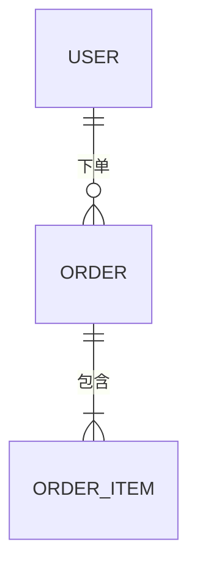
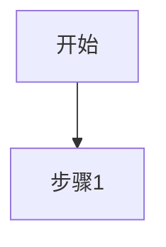

# 文档模板参考

> 以下模板是 bootstrapping-docs skill 输出文档的格式规范。模板内容为中文，与用户沟通时使用中文。

## 00_项目概览.md

```markdown
# 项目名称

> 一句话描述：XXX 是一个帮助 XXX 实现 XXX 的工具/系统/平台。

## 技术栈

| 层次 | 技术选型 |
|------|---------|
| 前端 | |
| 后端 | |
| 数据库 | |
| 部署 | |

## 文档索引

| 文档 | 说明 |
|------|------|
| [PRD](01_PRD_产品需求规格说明书.md) | 产品需求规格 |
| [TDD](02_TDD_架构设计文档.md) | 架构设计 |
| ... | |

## 快速开始

（环境搭建、启动命令等）
```

---

## 01_PRD_产品需求规格说明书.md

```markdown
# 产品需求规格说明书（PRD）

**版本**：v1.0
**更新日期**：YYYY-MM-DD
**状态**：草稿 / 评审中 / 已确认

---

## 1. 背景与目标

### 1.1 项目背景

### 1.2 目标用户

### 1.3 核心目标

## 2. 功能需求

### 2.1 功能清单

| 功能模块 | 功能描述 | 优先级 |
|---------|---------|-------|
| | | P0/P1/P2 |

### 2.2 用户故事

**作为** [用户角色]，**我希望** [功能]，**以便** [价值]。

**验收标准**：
- [ ] 条件 1
- [ ] 条件 2

## 3. 非功能需求

- 性能：
- 安全：
- 兼容性：

## 4. 不在范围内（Out of Scope）

明确列出本期不做内容，避免范围蔓延。

## 5. 变更记录

| 版本 | 日期 | 修改内容 | 修改人 |
|------|------|---------|-------|
| v1.0 | | 初始版本 | |
```

---

## 02_TDD_架构设计文档.md

```markdown
# 架构设计文档（TDD）

**版本**：v1.0
**更新日期**：YYYY-MM-DD

---

## 1. 系统概述

## 2. 技术选型

| 类别 | 选型 | 选择理由 |
|------|------|---------|
| 后端框架 | | |
| 数据库 | | |
| 缓存 | | |
| 消息队列 | | |
| 部署方式 | | |

## 3. 系统架构

### 3.1 整体架构图

（使用 Mermaid 或文字描述）

### 3.2 模块划分

| 模块名 | 职责描述 |
|-------|---------|
| | |

## 4. 核心流程

（关键业务流程的时序图或流程图）

## 5. 部署架构

## 6. 技术风险与应对

| 风险 | 影响 | 应对方案 |
|------|------|---------|
| | | |

## 7. 变更记录

| 版本 | 日期 | 修改内容 |
|------|------|---------|
```

---

## 03_ERD_数据库设计文档.md

```markdown
# 数据库设计文档（ERD）

**版本**：v1.0
**更新日期**：YYYY-MM-DD

---

## 1. 数据库概述

- 数据库类型：
- 数据库版本：
- 字符集：

## 2. 实体关系图



## 3. 数据表设计

### 表名：xxx

**说明**：

| 字段名 | 类型 | 是否必填 | 默认值 | 说明 |
|-------|------|---------|-------|------|
| id | BIGINT | 是 | 自增 | 主键 |
| created_at | DATETIME | 是 | NOW() | 创建时间 |

**索引**：
- 主键：`id`
- 唯一索引：`xxx`
- 普通索引：`xxx`（用于 xxx 查询）

## 4. 变更记录

| 版本 | 日期 | 修改内容 |
|------|------|---------|
```

---

## 04_API_接口文档.md

```markdown
# 接口文档（API）

**版本**：v1.0
**更新日期**：YYYY-MM-DD
**Base URL**：`https://api.example.com/v1`

---

## 1. 通用说明

### 1.1 认证方式

### 1.2 通用响应格式

```json
{
  "code": 0,
  "message": "success",
  "data": {}
}
```

### 1.3 错误码

| 错误码 | 说明 |
|-------|------|
| 0 | 成功 |
| 400 | 请求参数错误 |
| 401 | 未授权 |
| 500 | 服务器内部错误 |

## 2. 接口列表

### 2.1 模块名

#### 接口名称

- **Method**：POST
- **Path**：`/resource`
- **描述**：

**请求参数**：

| 参数名 | 类型 | 必填 | 说明 |
|-------|------|------|------|
| | | | |

**请求示例**：
```json
{}
```

**响应示例**：
```json
{}
```

## 3. 变更记录

| 版本 | 日期 | 修改内容 |
|------|------|---------|
```

---

## 05_SDD_详细设计文档.md

```markdown
# 详细设计文档（SDD）

**版本**：v1.0
**更新日期**：YYYY-MM-DD

---

## 1. 模块划分

| 模块 | 子模块 | 职责 | 关联文件/目录 |
|------|-------|------|-------------|
| | | | |

## 2. 核心流程详细设计

### 2.1 流程名称

**触发条件**：
**前置条件**：
**后置条件**：

流程图：


**异常处理**：

## 3. 关键算法说明

## 4. 模块间接口定义

## 5. 变更记录

| 版本 | 日期 | 修改内容 |
|------|------|---------|
```

---

## 06_项目计划与进度表.md

```markdown
# 项目计划与进度表

**版本**：v1.0
**更新日期**：YYYY-MM-DD
**项目周期**：YYYY-MM-DD ~ YYYY-MM-DD

---

## 1. 里程碑

| 里程碑 | 目标 | 计划完成日期 | 状态 |
|-------|------|------------|------|
| M1 | 完成基础框架搭建 | | ⬜ 未开始 |
| M2 | 完成核心功能开发 | | ⬜ 未开始 |
| M3 | 测试与上线 | | ⬜ 未开始 |

状态标记：⬜ 未开始 / 🔄 进行中 / ✅ 已完成 / ❌ 延期

## 2. 任务分解

| 任务 | 负责人 | 预计工时 | 开始日期 | 完成日期 | 状态 |
|------|-------|---------|---------|---------|------|
| | | | | | |

## 3. 风险登记

| 风险描述 | 概率 | 影响 | 应对措施 |
|---------|------|------|---------|
| | 高/中/低 | 高/中/低 | |

## 4. 变更记录

| 版本 | 日期 | 修改内容 |
|------|------|---------|
```
